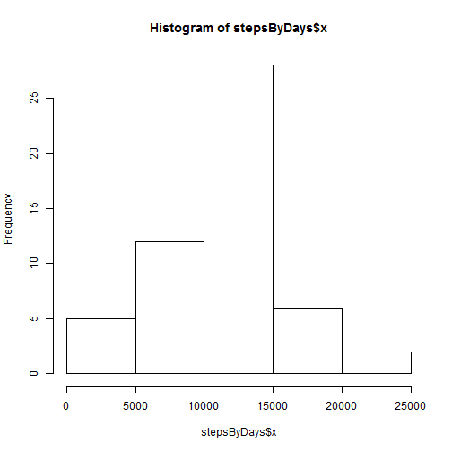
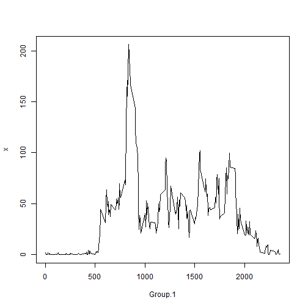
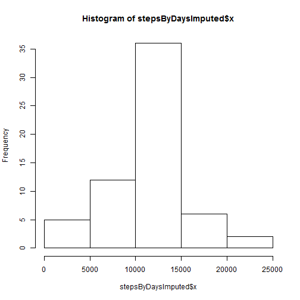

Reproducible Research - Assignment 1
========================================================

The following contains an analysis of the data provided for the assignment 1, answering all questions.

* Loading the data

```r
activity <- read.csv("C:/kaggle/reproducible data analysis/homework 1/RepData_PeerAssessment1/activity.csv")
```

* Cleaning it, formating dates and eliminating NA values.

```r
activity[,2]<-as.Date(activity[,2])
activityClean<-activity[!is.na(activity$steps),]
```

* Calculating the total number of steps taken per day.

```r
stepsByDays<-aggregate(as.numeric(activityClean$steps), list(activityClean$date), FUN=sum)
```

* Plotting a histogram of the total number of steps taken each day. Note the resemblance to a Normal distribution, which you would expect.


```r
hist(stepsByDays$x)
```

 


```r
meanStepsPerDay<-mean(stepsByDays$x)
medianStepsPerDay<-median(stepsByDays$x)
```
* The mean number of steps per day is 1.0766 &times; 10<sup>4</sup>, the median number of steps is 1.0765 &times; 10<sup>4</sup>.

* Showing a plot of the average number of steps in an interval.


```r
stepsByIntervalsInDays<-aggregate(as.numeric(activityClean$steps), list(activityClean$interval), FUN=mean)
plot(stepsByIntervalsInDays,type="l")
```

 


```r
maxInterval<-stepsByIntervalsInDays[stepsByIntervalsInDays$x==max(stepsByIntervalsInDays$x),1]
```

* Interval number 835 is the max interval.


```r
numberOfNAValues<-nrow(activity[is.na(activity$steps),])
```

* The number of NA's in the dataset is 2304. The NA's are isolated to the number of steps taken.

* I am imputing the missing values by replacing them with the average value for the corresponding interval. This seems most appropriate as it takes into account the daily variation.


```r
colnames(stepsByIntervalsInDays)[1]<-"interval"
withMeanIntervalValues<-merge(activity,stepsByIntervalsInDays,by="interval")
withMeanIntervalValues$steps[is.na(withMeanIntervalValues$steps)] <- withMeanIntervalValues$x[is.na(withMeanIntervalValues$steps)]
withMeanIntervalValues<-withMeanIntervalValues[,1:3]

stepsByDaysImputed<-aggregate(as.numeric(withMeanIntervalValues$steps), list(withMeanIntervalValues$date), FUN=sum)
```

* Plotting a histogram of the total number of steps taken each day WITH IMPUTED VALUES. Note the resemblance to a Normal distribution, which you would expect.

```r
hist(stepsByDaysImputed$x)
```

 


```r
meanStepsPerDayImputed<-mean(stepsByDaysImputed$x)
medianStepsPerDayImputed<-median(stepsByDaysImputed$x)
```

* The mean total number of steps taken per day is 1.0766 &times; 10<sup>4</sup>. The median total number of steps taken per day is 1.0766 &times; 10<sup>4</sup>. The values don't differ siginficantly and the estimates stay rougly the same(shifting upwards absolutely for the estimate of steps taken, which is to be expected).


* Plotting the difference by weekday/weekend

```r
withMeanIntervalValues$isWeekday<-weekdays(withMeanIntervalValues$date)

withMeanIntervalValues$isWeekday[withMeanIntervalValues$isWeekday=='subota' | withMeanIntervalValues$isWeekday=='nedjelja']<-'weekend'
withMeanIntervalValues$isWeekday[withMeanIntervalValues$isWeekday!='weekend']<-'weekday'
withMeanIntervalValues$isWeekday<-as.factor(withMeanIntervalValues$isWeekday)

stepsByIntervalsInDaysImputed<-aggregate(as.numeric(withMeanIntervalValues$steps), list(withMeanIntervalValues$interval,withMeanIntervalValues$isWeekday), FUN=mean)

library(lattice)
xyplot(x~Group.1 | Group.2,data=stepsByIntervalsInDaysImputed,type='l',xlab='Interval',ylab='Number of steps',layout=c(1,2))
```

 
